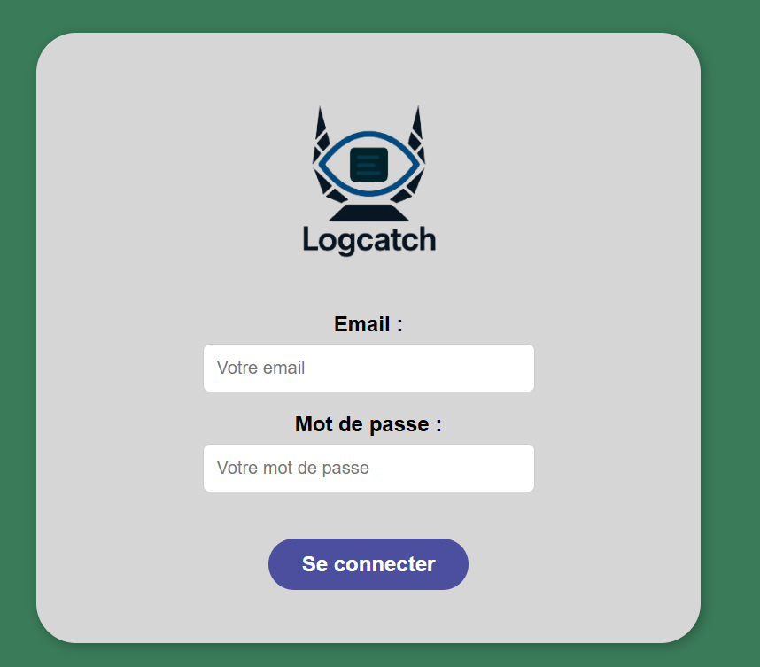
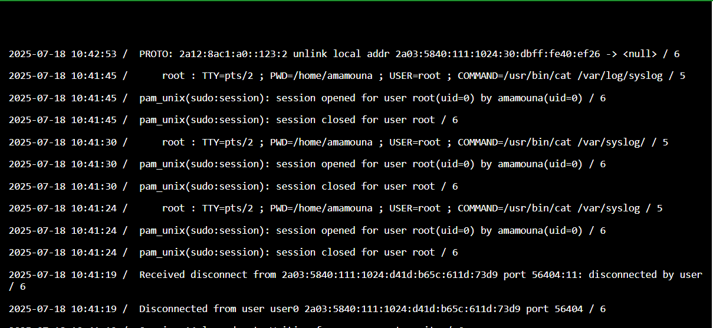

# Documentation utilisateur — Système de gestion des logs

## 1. Présentation 

Ici le système permet de gérer les logs générés par un serveur web. Il couvre la collecte, la configuration, la réception et le stockage des logs. Il y'a plusieurs acteurs tant principales que secondaires, chacun ayant des actions spécifiques.

---

## 2. Acteurs du système

### a. Utilisateur
- Accède au site web.
**https://logcatch.daisuke39.fr/**:

- S’authentifier avec ses identifiants.

-Sélectionner son instance

### b. Administrateur
**S'authentifier confère utilisateur**
- Configure les paramètres des logs.

- Surveiller le fonctionnement du serveur.

### c. Application
- Envoie des requêtes au serveur web.

- Provoque la génération de logs.

### d. Serveur de collecte de logs
- Reçoit les logs envoyés par le serveur web.
- Lit et stocke les logs.

---

## 4. Remarques générales

- Les utilisateurs sont les administrateurs il n'y a pas de notion proprement dit d'utilisateurs et il n' y a pas de droits spécifiques conférés aux administrateurs tous ont les mêmes droits.

- Les administrateurs créent des comptes à l'aide d'un script stocké  à la racine du code .

- Les logs sont générés et tranférés automatiquement.
