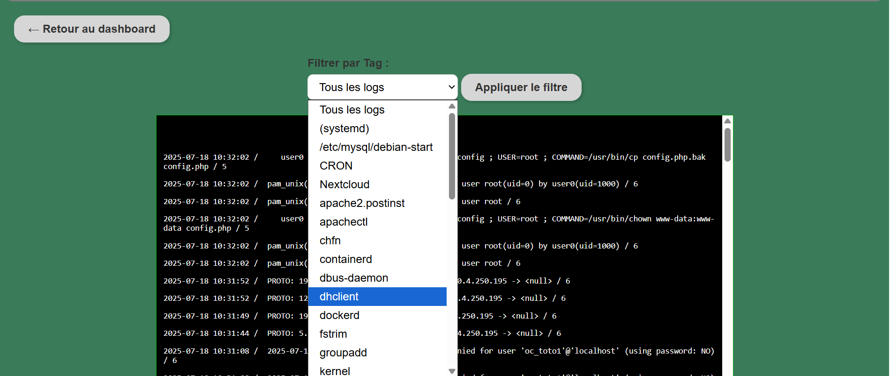

# Documentation utilisateur — Système de gestion des logs

## 1. Présentation 

Les logs sont générés par Nextcloud et le serveur web ensuite il envoie les logs via Rsyslog sur le serveur de base de données et pour les afficher sur LogCatch (application web).  
Il couvre la génération, la configuration, la réception et le stockage des logs.  
Il implique plusieurs acteurs, chacun ayant des actions spécifiques.

---

## 2. Acteurs du système

### a. Utilisateur
- Accède au site web.
**https://logcatch.daisuke39.fr/**:

- S’authentifier avec ses identifiants  pour accéder aux fonctionnalités.

### b. Administrateur
**S'authentifier confer utilisateur**
- Configure les paramètres des logs.

- Surveille le fonctionnement du serveur.

### c. Application
- Envoie des requêtes au serveur web.

- Provoque la génération de logs.

### d. Serveur de collecte de logs
- Reçoit les logs envoyés par le serveur web.
- Lit et stocke les logs.

---

## 4. Remarques générales

- Les utilisateurs sont les administrateurs il n'y a pas de notion proprement dit d'utilisateurs et il n' y a pas de droits spécifiques  .
- Les administrateurs créent des comptes à l'aide d'un script stocké  à la racine du code .
- Les logs sont générés et tranférés automatiquement.
