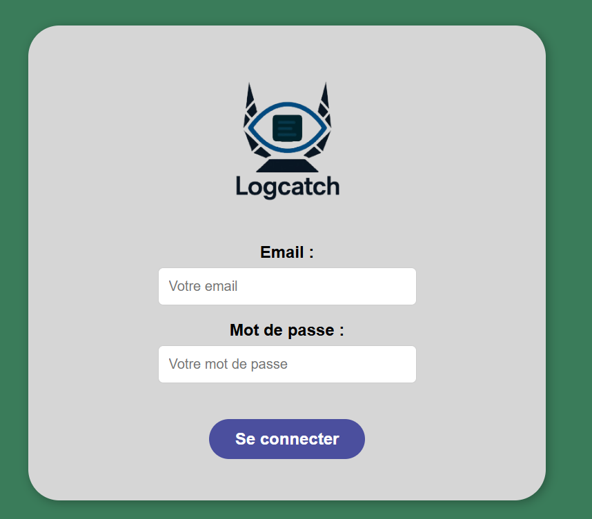
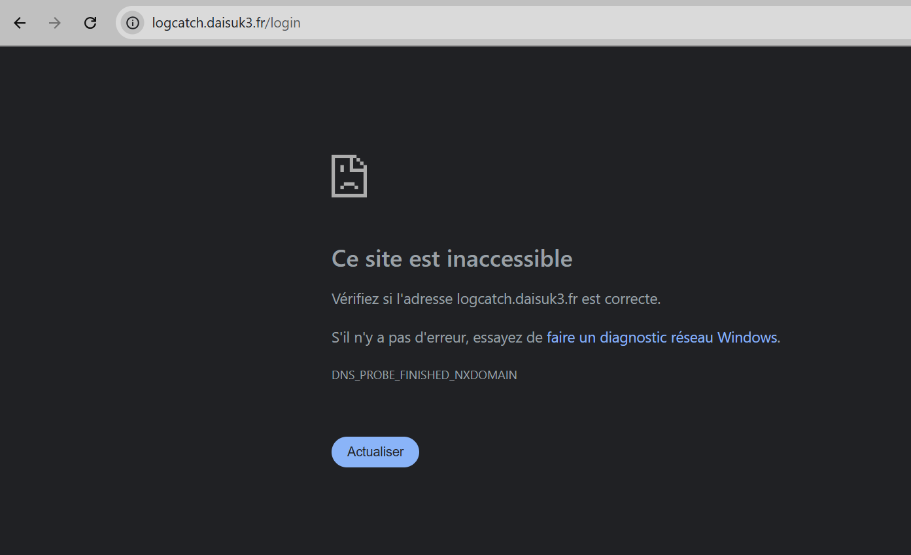
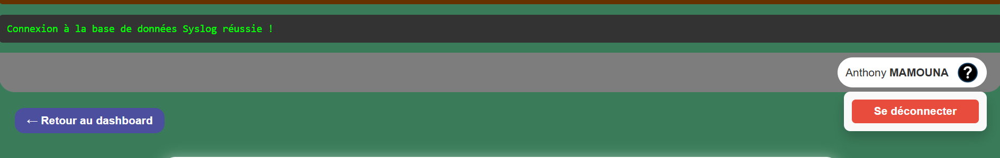
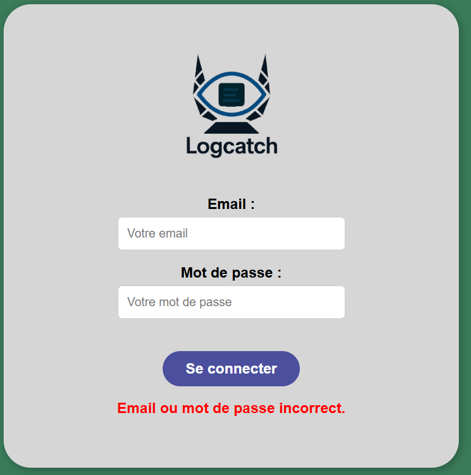
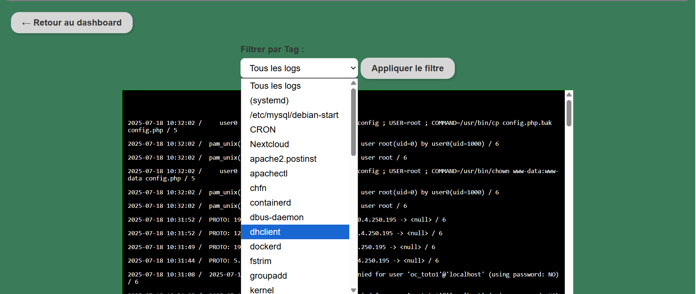
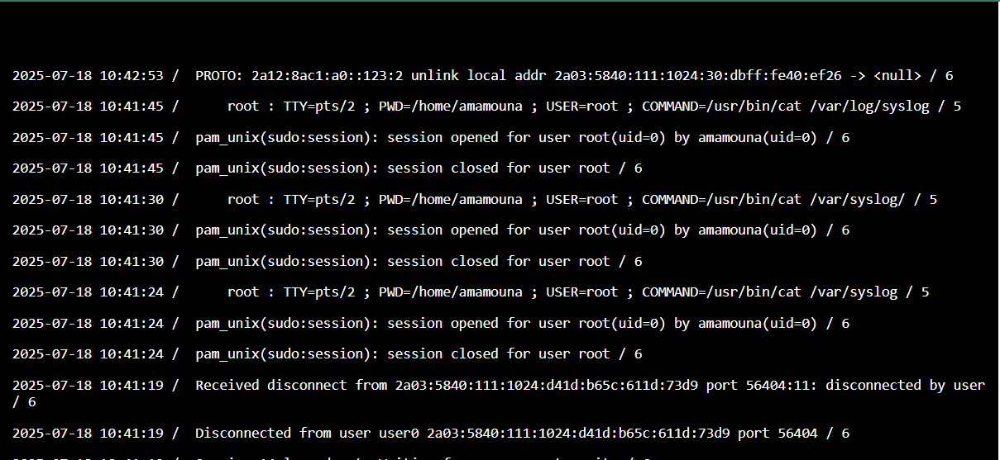
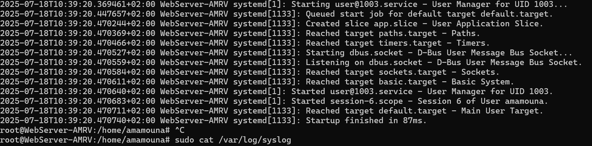

# Phase de test — Système de gestion des logs

## Objectif
Vérifier le bon fonctionnement des principales fonctionnalités et l’interaction correcte entre les rôles : utilisateur, administrateur, application, serveur de collecte.

---

## Plan de tests

### 1. Accès au site

| Etat   | Test                           | Entrée                | Résultat attendu                        |
|------|--------------------------------|-----------------------|-----------------------------------------|
| Réussi | Accès à l’URL                  | URL valide            | Page d’accueil ou de connexion affichée |
| Réussi | Accès à une URL invalide       | URL invalide          | Message d’erreur ou redirection         |

---

### 2. Authentification

| Etat | Test                           | Entrée                | Résultat attendu                        |
|------|--------------------------------|-----------------------|-----------------------------------------|
| Réussi | Connexion avec identifiants    | Identifiants valides  | Connexion réussie                       |
| Réussi | Connexion avec erreur          | Identifiants invalides| Message d’erreur                        |
| Non testé | Session expirée                | Session invalide      | Redirection vers la connexion           |

---

### 3. Configuration des logs (Administrateur)

| Etat   | Test                           | Entrée                | Résultat attendu                        |
|------|--------------------------------|-----------------------|---------------------------------------
| Réussi | Modifier le format des logs    | Choix du format       | Format appliqué                         |

---

### 4. Surveillance du serveur (Administrateur)

| Etat   | Test                           | Entrée                | Résultat attendu                        |
|------|--------------------------------|-----------------------|-----------------------------------------|
| Réussi | Affichage des logs récents     | Aucun filtre          | Liste des logs affichée                 |

---

### 5. Génération des logs (Application)

| Etat   | Test                           | Entrée                | Résultat attendu                        |
|------|--------------------------------|-----------------------|-----------------------------------------|
| Réussi | Requête valide                 | Requête API correcte  | Log généré                              |

---

### 6. Transmission des logs (Serveur Web)

| Etat  | Test                           | Entrée                | Résultat attendu                        |
|------|--------------------------------|-----------------------|-----------------------------------------|
| Réussi | Envoi de log                   | Log bien formé        | Log reçu par le serveur de collecte     |

---

---

## Environnement de test

- Serveur web
- Outils API
- Script de test
- Serveur de collecte de logs
- Interface d’administration LogCatch

---

## Critères de validation

- Les logs sont générés et transmis correctement.
- Les accès sont filtrés selon le rôle.
- La configuration des logs est prise en compte.
- Les erreurs sont remontées et consultables.
- Les logs sont stockés et affichés
- logcaster connexion : pouvoir se connecter au site 
- Mise a jour des logs : modifier le nom du dernier log générer et voir si le serveur de collecte effectue la modification
- Affichage des logs : on peut voir la liste des logs présentes sur la base de données
